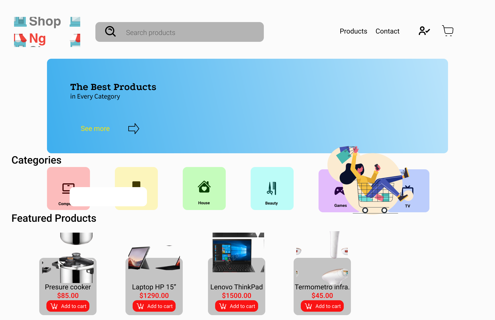
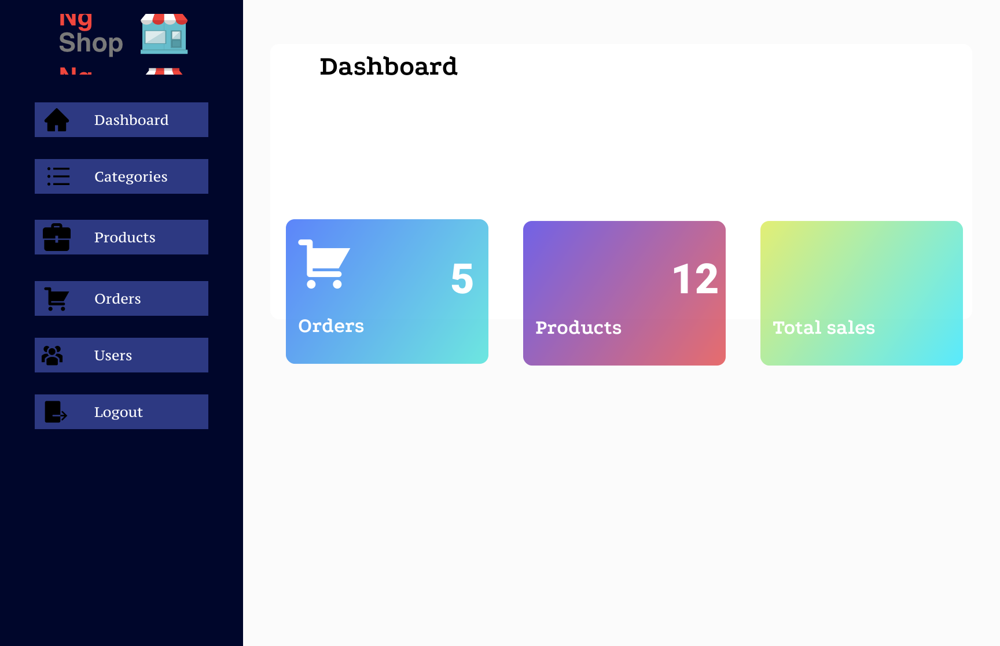
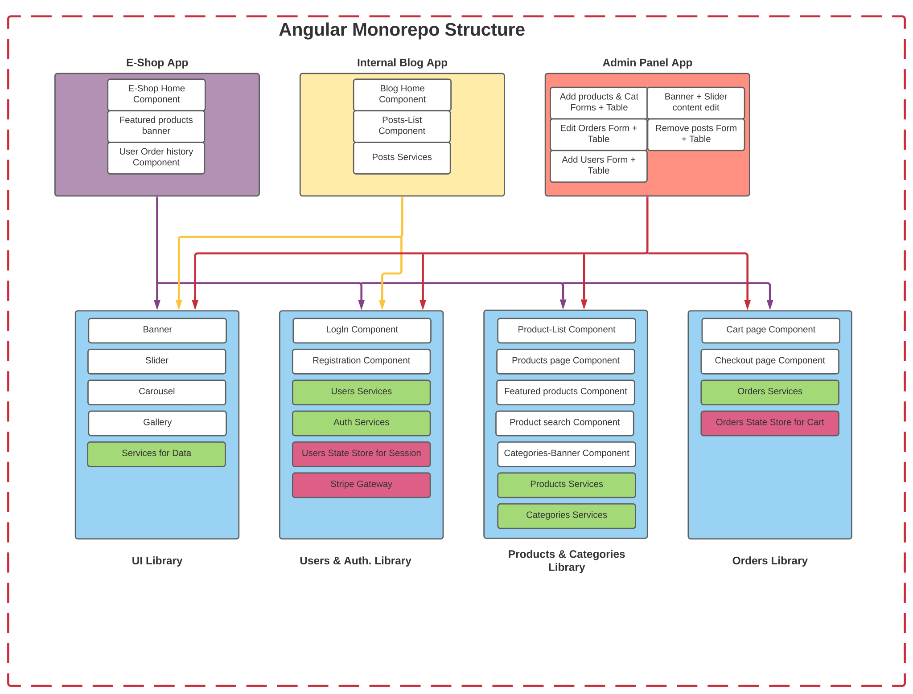

# **`Frontend project for the MEAN Fullstack E-Shop`**

# **Screenshots**

## Main Page

## Admin Page

# **Structure of the Monorepo**

This project is a Nx Monorepo, the structure of the project is as follows:

# **How to use it?**

1. Configure your API connection in the _environments_ folder,you can use different configurations 
for testing and production

2. Install the dependencies from the package.json

3. Run the script that you need, you can use:

> _npm run start_ for the whole project
> 
> _npm run star-eshop_ for just the eshop app
> 
> _npm run start-admin_ for just the admin app

If you want to deploy the application to a server you need to build it first, this step depends on your
service provider, if you're going to use some service like Heroku you need a standalone folder that you 
can use, but if you have your own VPS you can deploy directly just configure a CI/CD cycle for you to
see the changes ASAP.

**NOTE: take in count that you need the backend to use most of the functionality of this 
project, you can go to [ECommerce](https://github.com/SaladinoBelisario/E-Commerce_Sample) to see
the parent project.**